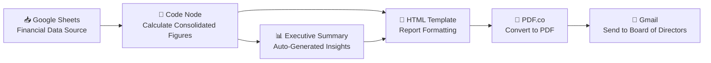

# 📊 Consolidated Financial Reporting Automation


An end-to-end **n8n workflow** that automatically generates a board-ready **Consolidated Financial Report** — pulling live financial data, structuring it into a CFO/Board memo format, and delivering it without manual reporting work.

---

## 🧩 Overview

Finance teams spend hours every reporting cycle manually compiling numbers into board-ready memos. This workflow automates that entire process — from data pull to formatted executive report — so Finance leaders get a **consistent, audit-ready Consolidated Financial Report in minutes**.

---

## ⚙️ Architecture



---

## 🚀 Features

- **Automated Data Aggregation** — pulls consolidated financial data directly from Google Sheets
- **Dynamic Executive Summary** — auto-generates narrative insights (e.g. operational status, key variances)
- **CFO Memo Formatting** — structured To / From / Date / Subject header, consistent with board reporting standards
- **Disclosure Logic** — flags special conditions (e.g. dormant or pre-operational periods) automatically
- **PDF Generation** — converts the formatted report into a clean, shareable PDF via PDF.co
- **Automated Delivery** — emails the finalized report directly to the Board via Gmail

---

## 🛠️ Tech Stack

| Component | Tool |
|---|---|
| Workflow Engine | n8n |
| Data Source | Google Sheets |
| Logic / Calculations | JavaScript (Code Node) |
| Report Rendering | HTML |
| PDF Conversion | PDF.co API |
| Delivery | Gmail API |

---

## 📄 Sample Report Output

**Header block:**
```
CONSOLIDATED FINANCIAL REPORT
Group Financial Controller / CFO Statement

To: Board of Directors
From: Group Financial Controller / CFO
Date: [Auto-populated]
Subject: Executive Financial Summary – Reporting Period Ending [Current Date]
```

**Executive Summary (auto-generated example):**
> The following report summarizes the consolidated financial position and performance for the current reporting period. As reflected in the data, the Group is currently in a pre-operational or dormant phase, with no financial transactions recorded.

---

## 🧠 Technical Challenges & Solutions

| Challenge | Solution |
|---|---|
| Dynamically detecting "dormant vs active" financial periods | Built conditional logic in the Code node to compare transaction volume against thresholds and auto-select the correct narrative template |
| Maintaining consistent board-memo formatting across periods | Standardized HTML template with placeholder variables for all dynamic fields |
| Converting styled HTML to a clean, print-ready PDF | Used PDF.co with custom CSS to preserve formatting fidelity |
| Avoiding manual distribution errors | Automated Gmail delivery directly tied to workflow completion, removing manual send step |

---

## 📌 Roadmap

- [ ] Add multi-entity consolidation (subsidiary-level rollups)
- [ ] Integrate variance commentary vs. prior period
- [ ] Add Slack notification on report generation
- [ ] Support multi-currency consolidation

---

## 👤 About

Built by **Syed Ali Raza** — Finance & Accounts professional (Treasury, Tax, FP&A) transitioning into Finance Automation & Accounting Systems.

[](https://linkedin.com/in/syed-ali-raza1990)
[](mailto:Alisherazi51215@Yahoo.Com)
[](https://upwork.com/freelancers/syedaliraza73)

---

⭐ Part of a growing **Finance Automation Portfolio** — including Bank Reconciliation, AP Invoice Processing, Payroll Automation, Cash Flow Forecasting, and Budget vs. Actual Variance Analysis workflows.
